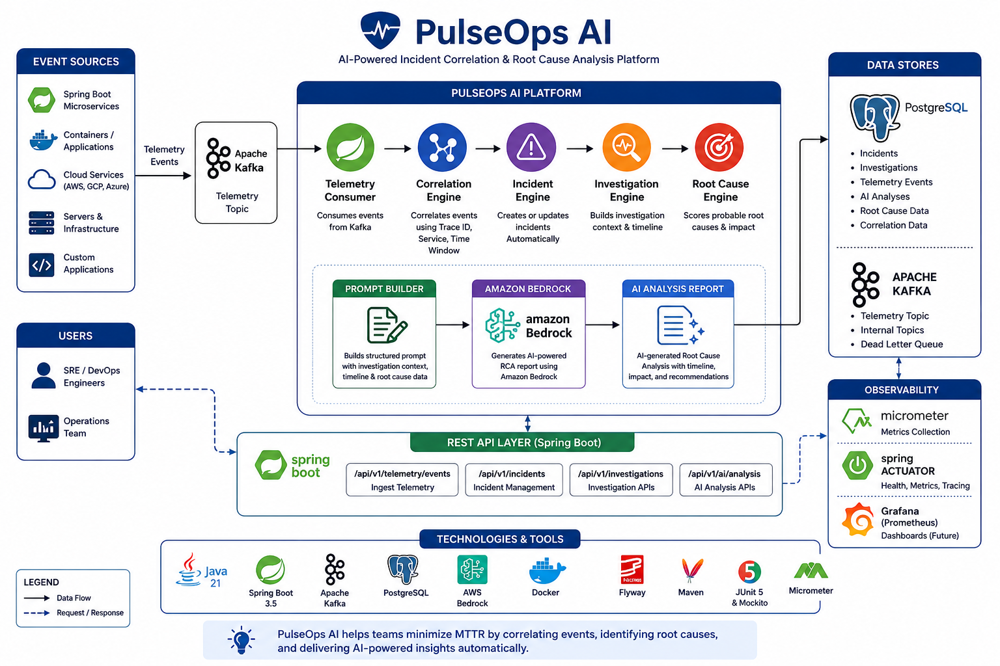

# 🚀 PulseOps AI

> **An AI-powered Incident Correlation & Root Cause Analysis Platform built with Java 21, Spring Boot, Kafka and Amazon Bedrock.**

PulseOps AI automatically ingests telemetry events, correlates failures across distributed services, identifies probable root causes using deterministic analysis, and generates AI-powered incident investigation reports using Amazon Bedrock.

---

## ✨ Why PulseOps AI?

Modern microservice architectures generate thousands of logs and events every minute. During production outages, engineers spend valuable time manually correlating logs across multiple services.

PulseOps AI automates this workflow by:

- 📥 Ingesting telemetry events in real time
- 🔗 Correlating related failures
- 🚨 Creating incidents automatically
- 🧠 Performing deterministic root cause analysis
- 🤖 Generating AI-powered investigation reports
- 📊 Exposing operational metrics for observability

---

# 🏗 Architecture

<p align="center">
  
</p>

PulseOps AI ingests telemetry events from distributed services, correlates failures, creates incidents automatically, performs deterministic root cause analysis, and leverages Amazon Bedrock to generate AI-powered investigation reports. The platform exposes REST APIs, operational metrics, and persists all analysis in PostgreSQL.

```text
                    +--------------------+
                    |  Client Services   |
                    +---------+----------+
                              |
                       Telemetry Events
                              |
                              ▼
                       Apache Kafka Topic
                              |
                              ▼
                    Telemetry Consumer
                              |
                              ▼
                  Correlation Engine
                              |
                              ▼
                 Incident Management
                              |
                              ▼
               Investigation Engine
                              |
                              ▼
            Deterministic RCA Engine
                              |
                              ▼
                Prompt Builder (LLM)
                              |
                              ▼
                 Amazon Bedrock AI
                              |
                              ▼
               AI Investigation Report
                              |
                              ▼
                    PostgreSQL Storage
                              |
                              ▼
                    REST APIs / Swagger
```

---

# ⚙️ Tech Stack

| Category | Technologies |
|----------|--------------|
| Language | Java 21 |
| Framework | Spring Boot 3.5 |
| Messaging | Apache Kafka |
| Database | PostgreSQL |
| ORM | Spring Data JPA |
| Migration | Flyway |
| AI | Amazon Bedrock (Nova Lite) |
| Cloud SDK | AWS SDK v2 |
| Observability | Spring Boot Actuator, Micrometer |
| API Docs | OpenAPI / Swagger |
| Build Tool | Maven |
| Testing | JUnit 5, Mockito |
| Containerization | Docker |

---

# 🔥 Key Features

### Intelligent Incident Correlation

- Correlates telemetry events using Trace IDs
- Prevents duplicate incidents
- Groups failures into a single investigation

---

### Root Cause Analysis Engine

Automatically identifies:

- Earliest failing service
- Failure propagation chain
- Cross-service dependencies
- Confidence score

---

### AI Investigation Reports

Uses Amazon Bedrock to generate:

- Executive Summary
- Probable Root Cause
- Failure Timeline
- Business Impact
- Recommended Actions
- Confidence & Caveats

---

### Observability

- Spring Boot Actuator
- Micrometer Metrics
- Correlation ID propagation
- AI request metrics
- Health endpoints

---

## 📁 Project Structure

```text
pulseops-ai
│
├── src
│   ├── ai
│   │    ├── client
│   │    ├── controller
│   │    ├── prompt
│   │    ├── repository
│   │    └── service
│   │
│   ├── incident
│   ├── telemetry
│   ├── investigation
│   ├── observability
│   ├── common
│   └── config
│
├── docker-compose.yml
├── Dockerfile
├── pom.xml
└── README.md
```
```

---

# 🚀 Running Locally

## Clone

```bash
git clone https://github.com/<your-username>/pulseops-ai.git
```

## Start Dependencies

```bash
docker compose up -d
```

## Run Application

```bash
mvn spring-boot:run
```

---

# 📖 API Documentation

Swagger UI

```
http://localhost:8080/swagger-ui/index.html
```

Actuator

```
http://localhost:8080/actuator
```

---

# 🤖 Example AI Output

PulseOps AI generates reports similar to:

- Executive Summary
- Root Cause Identification
- Failure Chain
- Business Impact Assessment
- Recommended Mitigation Steps
- Confidence Score

Each report is persisted in PostgreSQL for future analysis.

---

# 📊 Observability

PulseOps exposes operational metrics using Micrometer.

Example:

```
GET /actuator/metrics/pulseops.ai.requests
```


# 👩‍💻 Author

**Mansi Solanki**

Software Engineer passionate about Java, Distributed Systems, Cloud-Native Applications, and AI-powered Backend Engineering.

- LinkedIn: https://linkedin.com/in/mansisolanki39